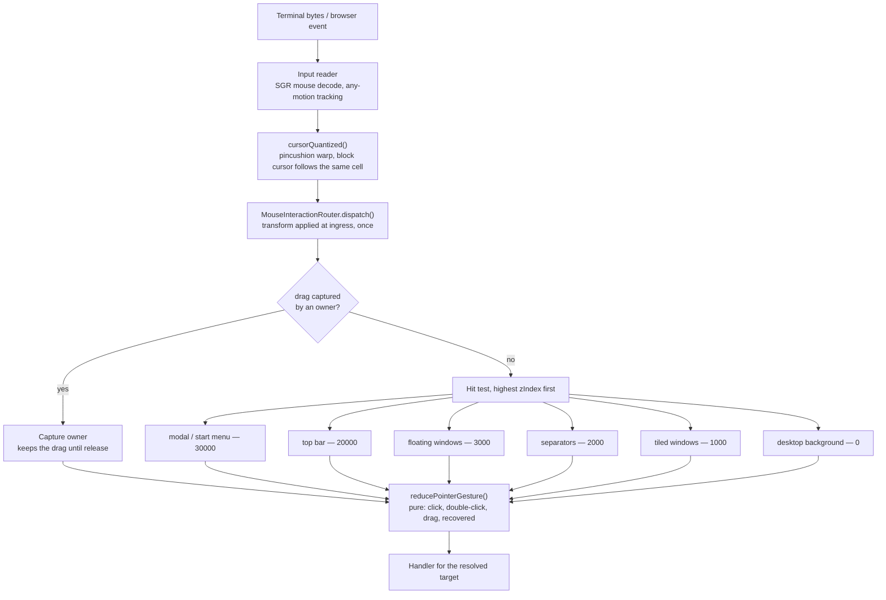

# Pointer pipeline

Supports `../overview.md` — "one pointer authority". History: `../../todo/done/040-pointer-input-architecture.md`.

A press, from terminal bytes to the handler that answers it. The point of the rebuild was that every stage below happens
exactly once, in one place.

## What to notice

- **The warp is applied at ingress and nowhere else.** Downstream code works in one coordinate space. Every bug in the
  old stack came from a second place re-deriving coordinates.
- **The background is layer 0, not layer first.** It used to get first refusal and swallow clicks meant for windows;
  ordering it last by z is what made "click the title bar behind a background chip" work.
- **Gesture recognition is a pure reducer**, so double-click-versus-drag is a unit test rather than a live experiment.
- **A golden hit map** (`packages/exomux/tests/fixtures/hit_map/`) records which target owns every cell, so a change to
  any of this is a reviewable diff.
