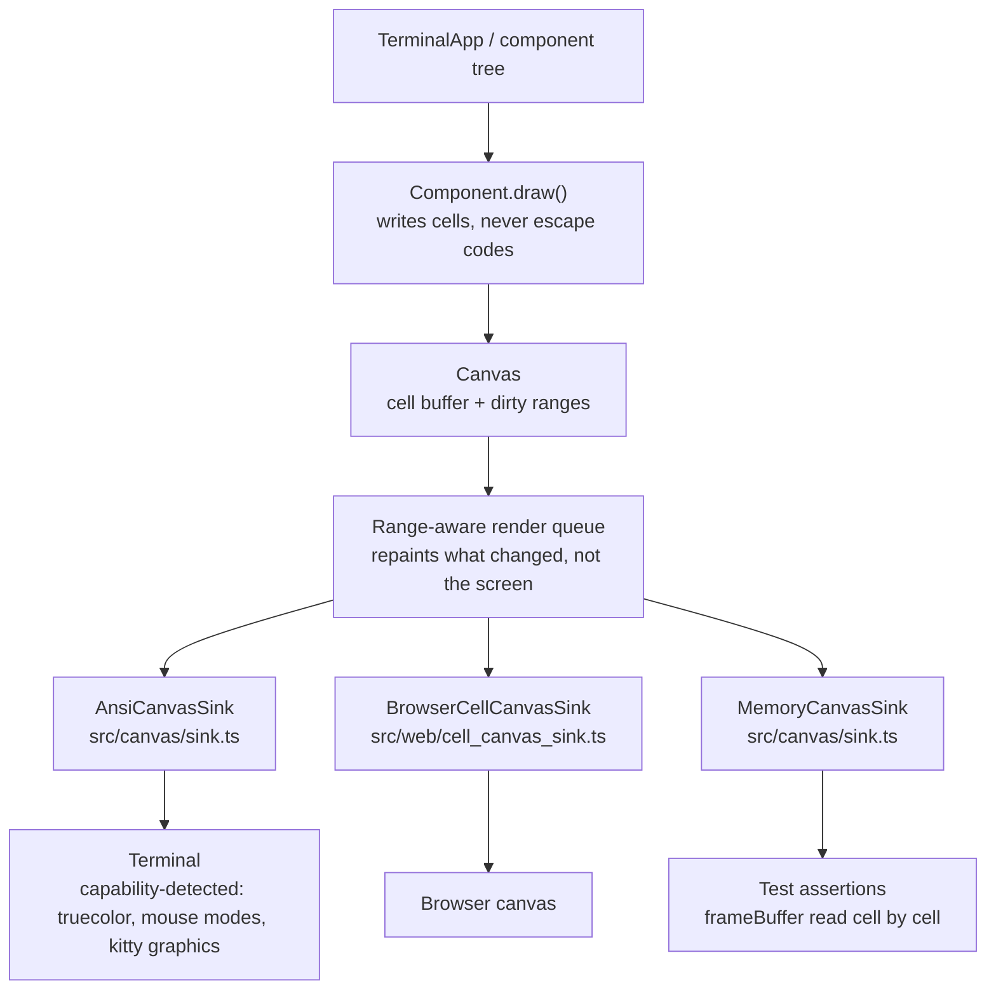

# Render pipeline

Supports `../overview.md` — "renderer neutrality".

One component tree, three outputs. Components describe cells; nothing above the sink knows what a terminal is.

## What to notice

- **The fork is at the sink, not in the components.** A widget that emits `\x1b[` directly has broken the property that
  makes the browser build and the headless tests possible.
- **The test path is a first-class sink**, not a mock. What a test reads is what a terminal would have been sent, which
  is why a mounted test can catch a paint that never happened.
- **Capability detection lives below the sink.** Truecolor, mouse tracking modes and kitty graphics are negotiated with
  the terminal; components ask for a colour and get the best available representation.
