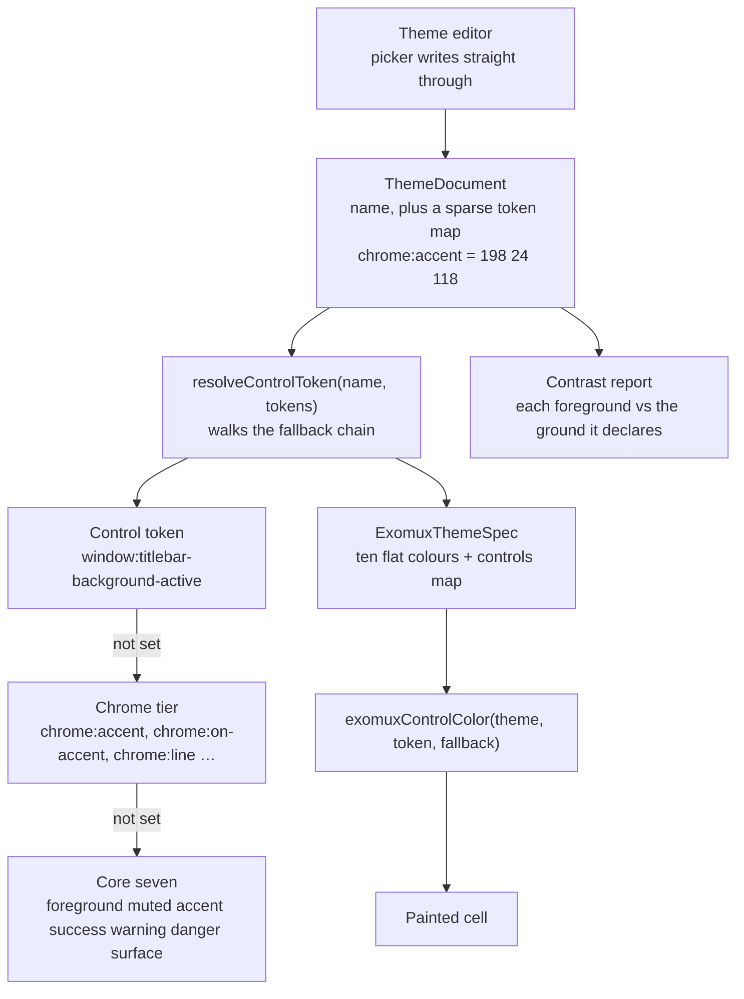

# Theme resolution

Supports `../overview.md` — "themes resolve, they do not spread". History: `../../todo/done/042-theme-editor.md`.

How one colour gets from a saved document to a painted cell, and what happens when the document does not mention it.

## What to notice

- **Every chain ends at one of the seven.** A theme that defines only those seven paints all forty-one controls, which
  is why adding vocabulary costs existing themes nothing.
- **The chrome tier is the fast path.** Six colours move every control that has not been individually overridden.
- **The editor writes the document, not the screen.** Live preview is the desktop re-resolving, so what you see while
  editing is what a save produces.
- **`exomuxControlColor` always takes a fallback**, so a theme with no document behind it — every preset before it is
  opened — paints exactly as it did before the vocabulary existed.
