# Architecture overview

What the layers are, which way dependencies point, and which boundaries are load-bearing. Written August 18 2026 against
the code as it stands; where the target and the current state differ it says so.

## Layers

Dependencies point downward only. Nothing in a lower layer knows about a higher one.

```mermaid
flowchart TD
  subgraph exomux["packages/exomux — the terminal desktop"]
    Main["main.ts<br/>launcher, session resolution, daemon spawn"]
    Host["host.ts<br/>the daemon: PTYs, replay ring, protocol"]
    Client["client.ts<br/>protocol client, descriptors, bootstrap"]
    Ctrl["controller.ts<br/>sessions, windows, themes, settings"]
    Paint["app.ts<br/>painting and input routing"]
  end
  subgraph app["src/app — application layer (mod.app.ts)"]
    TApp["TerminalApp<br/>routes, commands, keymaps, undo"]
    Bench["workbench_*<br/>window host, workspace, menus, status"]
    Mouse["mouse_bindings<br/>the pointer router"]
    TEdit["theme_editor<br/>CRUD over theme documents"]
  end
  subgraph comps["src/components — the widget set"]
    Widgets["List, Tree, Table, Input, Modal, Slider, ColorPicker …<br/>each a pure Controller plus a thin Component"]
  end
  subgraph core["src/ core"]
    Canvas["canvas/<br/>cells, sinks, range-aware repaint"]
    Layout["layout/<br/>flex, grid, linear, solvers"]
    Markup["markup/<br/>html + css authoring, cascade"]
    Signals["signals/<br/>Signal / Computed"]
    Theme["theme*<br/>tokens, control vocabulary, OKLCH, contrast"]
    Runtime["input_reader/, runtime/<br/>capabilities, PTY, kitty graphics"]
  end

  exomux -->|"consumes the library like any other application"| app
  app --> comps --> core
```

Diagrams for the flows that prose does not carry well: [render pipeline](diagrams/render-pipeline.md) ·
[pointer pipeline](diagrams/pointer-pipeline.md) · [exomux protocol](diagrams/exomux-protocol.md) ·
[theme resolution](diagrams/theme-resolution.md).

## Boundaries that matter

**Renderer neutrality** ([diagram](diagrams/render-pipeline.md)). Components describe cells; they never write escape
sequences. A `CanvasSink` turns cells into ANSI for a terminal, into a canvas for the browser, or into a buffer for a
test. This is why the same application runs in three places, and why a component that reaches for `\x1b[` directly is a
bug.

**Pure controller, thin component.** Every widget is a `XController` holding the logic and an `X extends Component` that
draws it. The controller is testable without a terminal, a mount, or a frame; the component is small enough to read.
`Modal`/`ModalController` and `Slider`/`SliderController` are the reference shape.

**One pointer authority** ([diagram](diagrams/pointer-pipeline.md)). `MouseInteractionRouter` owns hit-testing:
z-ordered targets, drag capture, and a transform applied at ingress so a warped display (exomux's pincushion shader) is
corrected once rather than per handler. Nothing downstream re-derives coordinates. Plan `040` is the history of what
happened when it did.

**The daemon outlives its clients** ([diagram](diagrams/exomux-protocol.md)). exomux's host holds the PTYs; clients
attach and detach. Any protocol addition is therefore a version-skew question first: capabilities are advertised in the
daemon's descriptor and gated on by the client, and an unknown message from an authenticated client is refused, not
fatal. Plan `041` is why.

**Themes resolve, they do not spread** ([diagram](diagrams/theme-resolution.md)). A theme is a sparse map of named
colours. Control tokens (`button:background`, `window:titlebar-background-active`, …) each fall back through a small
chrome tier to one of seven core colours, so a theme that sets seven values paints everything and a theme that sets
forty is equally valid.

## Current state vs target

- **exomux paints from a flat ten-colour spec**, not through the library's `Style` pipeline. The control-token
  vocabulary reaches it through an optional `controls` map on that spec, and only some painters consult it — window
  chrome, menus, list selection, scrollbars, modal buttons. The rest resolve and are editable but still paint from the
  ten. Finishing that wiring is mechanical; unifying the two models is a separate question nobody has needed answered
  yet.
- **Focus and selection are conflated in places.** The theme model has always had a `focused` state, but several
  surfaces paint the selected row with the accent whether or not the widget holds input focus. Target: one focus
  authority the components and the theme both resolve against — `todo/044-focus-model.md`.
- **`src/markup` and `src/layout` overlap in intent.** Markup composes a cascade over layout nodes; layout also has its
  own solvers. They coexist deliberately, but a reader should not expect one to be built on the other.
