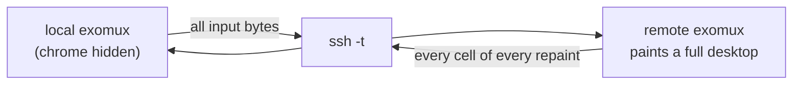
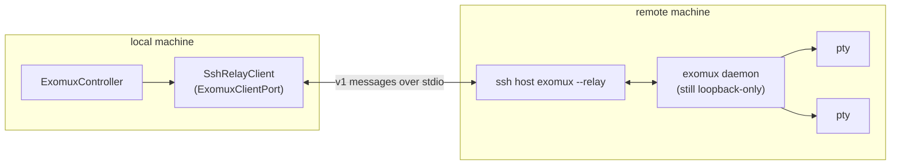
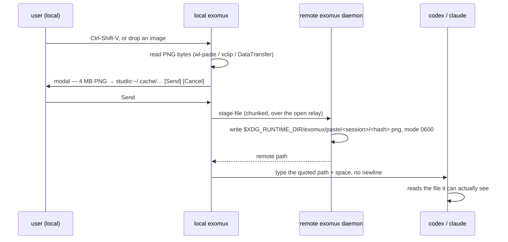

# Exomux remote sessions: fullscreen a remote desktop, and paste images into it

Status: **design proposals, August 23 2026.** Nothing implemented. This document exists to be argued with — the UX
options in "Three shapes" and the open decisions at the end need a call before code starts.

## Outcome

From a local exomux desktop, connect to an exomux running on another machine over SSH, present it full-screen, and —
while connected — paste or drag an image from the local machine into a remote `codex` or `claude` prompt so that the
remote application actually receives it.

Two halves, and they are separable:

1. **Connect.** A control beside the top-bar `[ ✕ ]` opens a host list; picking a host puts you on that machine's
   desktop full-screen. Picking "This machine" comes back.
2. **Transfer.** While connected, a local image on the clipboard or dropped on a remote terminal lands on the remote
   filesystem and its remote path is typed into the prompt.

Half 2 is the reason half 1 needs a real transport rather than a nested `ssh -t`. That argument is below.

## What already exists

Cited so no one rebuilds it:

- **SSH targets, remembered.** `035` shipped the `Network` panel: saved hosts plus live tailnet devices, persisted in
  workspace state, deletable (`packages/exomux/tailnet.ts`, `network_tree.ts`). The connect menu must read this list,
  not invent a second host registry.
- **Remote exomux discovery.** `035`/TSM-012 already probes a remote machine for `tmux` _and exomux_ sessions over one
  batched `ssh -o BatchMode=yes`, caches per target with a 30s TTL, and attaches with `ssh -t <target> exomux -a <name>`
  in a floating window. Connecting to a remote exomux is therefore _already possible_ — as a window, not as a desktop.
- **The client seam.** `ExomuxClientPort` (`packages/exomux/model.ts:129`) is the whole surface the controller uses:
  `list/spawn/attach/detach/input/resize/kill`, plus optional `subscribeSessions` and `publishWorkspace`. A remote
  transport is a second implementation of this interface, not a fork of the controller.
- **Shared desktop state.** `041` added the `workspace` protocol op (`protocol.ts:138`, `248`) — a host-retained,
  relayed key/value channel carrying appearance and window lifecycle to every attached client. A client attached to a
  remote daemon inherits that daemon's desktop layout for free.
- **Loopback-only by construction.** `host.ts:1332` throws `non-loopback-host` for any bind address that is not
  `127.0.0.1`/`::1`, and `client.ts:218` normalizes the URL through `normalizeLoopbackWebSocketUrl`. This is a good
  invariant and nothing here should weaken it — see "Why a relay and not a port forward".
- **Drag-and-drop, typed and policy-gated.** `src/app/drag_drop.ts` (INP-008) already models a drop as
  `{kind:"files", files:[…]}` with `readFile` **structurally absent** until a `DropPolicy` accepts it, and is explicitly
  adapter-neutral so browser `DataTransfer` and terminal adapters produce the same event. The image-drop path is a new
  adapter for an existing contract.
- **Clipboard, as a port.** `src/app/clipboard.ts` defines `ClipboardPort` with an OSC 52 terminal adapter and a browser
  adapter. It is text-only, and its own comment records why reads are unreliable: OSC 52 reads are usually disabled.
- **Paste interception with a consent modal.** TSM-014 shipped exactly the shape half 2 needs: a paste naming one
  existing local file, on an SSH shell, opens a `Send / Paste path / Cancel` modal and `scp`s the file
  (`controller.ts:363`, `2536`, `2689`). Image transfer is this flow with a different source and a different payload.
- **Kitty graphics.** `src/runtime/kitty_graphics.ts` and `src/runtime/graphics_surface.ts` exist (steps 1–2 of
  `plan/todo/hiatus/kitty-graphics-integration.md`). Relevant to _displaying_ an image, not to feeding one to `codex` —
  do not conflate the two.
- **Top-bar geometry.** `desktop_layout.ts` splits row 0 into start button (14 cells), taskbar, and `exomuxMenuQuitRect`
  — 5 cells, `[ ✕ ]`, painted at `app.ts:4627`, hit-tested at `app.ts:7839`. The new control goes immediately left of it
  and the shelf formula (`exomuxShelfBounds`) subtracts its width.

## Slice 0 — measure before modelling

**Do this before designing anything further.** This repository's own rule (`plan/arch/best-practices.md`, and the
183-line padding model it cost to learn) applies squarely here, because the image feature rests on an unverified claim
about two third-party applications.

Establish, by running them, not by reasoning:

1. Under a **local** exomux, does `Ctrl-V` of a clipboard image into `claude` and into `codex` already work? It very
   plausibly does: those applications read the OS clipboard themselves via `wl-paste`/`xclip`/`pbpaste`, which needs no
   help from the terminal. If it works, the local case is not a feature — it is already shipped, and the scope narrows
   to remoting only.
2. Over a plain `ssh -t host claude`, what happens on `Ctrl-V`? Expected: nothing useful, because the clipboard is on
   the wrong machine. Confirm the failure mode, so the fix is aimed at the real one.
3. What _exactly_ does each application accept as a typed image reference — a bare absolute path, a quoted path, an
   `@path` reference, a drag-drop `file://` URI? Record the current answer per application and per version. The
   injection format is a per-application profile precisely because this answer will drift.
4. What does the local terminal deliver when a file is dropped on it — `file:///…`, shell-quoted path, bare path, with
   or without a trailing newline? Ghostty is the maintainer's terminal; record it and at least one other.

Deliverable: a short findings section appended to this file, and the injection format decided from evidence. If (1)
shows local paste already works, say so and delete the local half of the feature rather than building it.

## Three shapes for "fullscreen a remote exomux"

All three share the same chrome — the top-bar control, the host list, the full-screen presentation, and the escape
gesture. They differ only in **what travels over SSH**, which is what determines cost, latency, and whether half 2 is
even reachable.

### Proposal A — Console: a nested full-screen PTY

Spawn `ssh -t <host> exomux -a <name>` into one chrome-less window sized to the whole desktop. The remote exomux paints
its own desktop into that PTY; the local one hides its top bar and forwards every byte.



- **For:** buildable now — `035` already spawns this exact argv, just into a floating window. No protocol change. Works
  against _any_ remote exomux version, and degrades to `ssh -t host tmux attach` for machines with no exomux at all. The
  remote's themes, backgrounds and settings are authentically the remote's.
- **Against:** the wire carries a full cell stream of a whole desktop. Butterchurn or any animated background on the
  remote becomes a continuous full-screen repaint over SSH — the `033` work that got a frame to 4.2 ms locally buys
  nothing across a network. Two desktops means two `Ctrl-N` prefixes, needing a tmux-style double-prefix convention. The
  local desktop learns nothing about remote windows, so the taskbar cannot show them. **And there is no structured
  channel**, so half 2 needs a separate SSH connection and a separate consent flow bolted alongside.

### Proposal B — Attach: the real protocol over an SSH stdio relay

Add `exomux --relay` on the remote: a mode that speaks the existing v1 protocol framed over stdin/stdout instead of a
WebSocket. Locally, run `ssh <host> exomux --relay`, wrap the child's stdio as a new `ExomuxClientPort`, and drive the
remote daemon exactly as if it were local. Remote sessions become **local windows** — local chrome, local background,
local theme; only PTY bytes cross the wire.



- **For:** the wire carries PTY output only — the same order of magnitude as `tmux`/`mosh`, not a repainted desktop.
  Backgrounds and shaders render locally at local speed. The `workspace` channel means the remote desktop's window
  layout arrives as data, so the local taskbar can list remote windows honestly. One local chrome, one prefix key, no
  nesting. And decisively: **the local client owns an authenticated, framed, already-open channel**, which is what makes
  image transfer a protocol message rather than a second `scp` handshake.
- **Against:** genuine protocol work — a relay mode, a framing layer, a new client port, and version-skew handling that
  now spans machines with independently-updated exomux builds. `035` parked this as TSM-030 ("only if remote hosts ever
  ship"); this task is that "if". The controller holds a single `client` (`controller.ts:677`), so more than one
  simultaneous host means a controller per host or a routing façade.

### Proposal C — Spaces: B's transport, presented as switchable desktops

Proposal B, presented as a **space switcher**. The desktop gains named spaces — `local`, `studio`, `renderbox` — and the
new top-bar control switches between them. "Fullscreen" is simply that a space owns the whole body; the only remote
chrome is a slim identity strip in the top bar. Windows are local windows fed by remote PTYs, which makes moving a
window between spaces a later possibility rather than a contradiction.

- **For:** matches the request most literally — the dropdown beside `[ ✕ ]` _is_ a space switcher, and full-screen is
  its natural presentation. Scales past one remote. Keeps exactly one chrome and one prefix key.
- **Against:** the most work. A space model touches the window host, the taskbar, persistence, and focus (`044`), and
  should not be attempted before B's transport is proven.

### Recommendation

**B is the engine, C is the presentation, A is the fallback — and the chrome is common to all three, so build it
first.**

Sliced so each lands on its own:

| Slice | Ships                                                                                    | Transport           |
| ----- | ---------------------------------------------------------------------------------------- | ------------------- |
| **0** | Findings from "measure before modelling"                                                 | none                |
| **1** | Top-bar control, host list, full-screen space shell, escape gesture, identity badge      | Console (A)         |
| **2** | `exomux --relay`, `SshRelayClient`, capability handshake, one SSH ControlMaster per host | Relay (B)           |
| **3** | Remote sessions as local windows; remote layout via the `workspace` channel              | Relay (B)           |
| **4** | Image capture → transfer → path injection, with consent modal                            | Relay, scp fallback |
| **5** | Named spaces, more than one host at once, cross-space window moves                       | Relay (C)           |

Slice 1 is worth landing alone: it is small, it proves the UX, and Console mode remains permanently useful for machines
running an older exomux or none at all. Slice 4 is the point of the exercise and should not wait for slice 5.

## The top-bar control

Today row 0 ends with `[ ✕ ]` at 5 cells (`EXOMUX_MENU_QUIT_WIDTH`). The connect control sits immediately to its left
and `exomuxShelfBounds` subtracts its width, exactly as it already subtracts the quit control's.

```
[ ≡ exomux ]  [1:zsh] [2:claude] [3:htop]             [ ⇄ ]  [ ✕ ]      ← local
[ ≡ exomux ]  [1:zsh] [2:claude]              [ ⇄ studio ]  [ ✕ ]      ← connected
```

**The bar must always name the machine your keystrokes reach.** When connected, the control widens to carry the host
short name and the top bar takes the theme's accent — never a hardcoded colour; all 13 themes resolve it. Wondering
which machine a `rm -rf` is about to land on is not an acceptable state for this UI to have.

Opening it (click, coarse tap, or `Ctrl-N c`) drops a `ContextMenu` — the same widget the start menu composites
(`start_menu.ts`), not a second hand-drawn list:

```
┌─ Connect ───────────────┐
│ ● This machine   Ctrl-N 0│
├─────────────────────────┤
│ ○ studio         Ctrl-N 1│
│ ○ renderbox      Ctrl-N 2│
│ ◐ buildbox    (offline)  │
├─────────────────────────┤
│   Connect to host…       │
│   Network panel…  Ctrl-N @│
└─────────────────────────┘
```

- Rows come from the `035` saved-host list and tailnet devices. Glyph pairs with colour for colour-blind safety, the
  convention `035` already set: `●` connected, `○` reachable, `◐` offline/relayed.
- `Ctrl-N 0` always returns to local, from anywhere, including mid-modal. This is the panic exit and must never be
  shadowed.
- Offline hosts stay visible and muted rather than hidden — discoverability over tidiness, again per `035`.
- Below ~72 desktop columns the badge collapses to the glyph plus a two-letter host tag; the mobile layout gives one
  full-screen window (see the exomux mobile-layout constraint) and the identity must survive that.

**Prefix collision, Console mode only.** Two exomuxes both want `Ctrl-N`. Convention: the local one owns it; pressing it
twice (`Ctrl-N Ctrl-N`) forwards a single `Ctrl-N` to the remote. This is tmux's rule and users already know it. In
Relay mode the problem does not arise — there is only one desktop.

## Image paste and drop into a remote `codex` / `claude`

### Why the obvious thing does not work

No terminal carries image bytes on paste. `codex` and `claude` accept images by reading the OS clipboard _themselves_,
or by being handed a filesystem path. When the application runs on the remote machine, a local `Ctrl-V` misses twice:
the terminal will not carry the bytes, and the remote clipboard is not the local one. So:

**capture locally → transfer over the connection → type the remote path.**



### 1. Capture

Add an `ImageClipboardPort` beside `ClipboardPort` in `src/app/clipboard.ts`, following the shape already there — one
interface, two adapters:

- **Terminal adapter:** argv-only subprocess, byte-capped, deadline-bounded — `wl-paste --type image/png`,
  `xclip -selection clipboard -t image/png -o`, an `osascript` PNG dump on macOS, `Get-Clipboard -Format Image` on
  Windows. Declared in `EXOMUX_PERMISSION_MANIFESTS` as an optional subprocess class with provenance, the way `035`
  declared `tailscale`/`ssh`/`scp` (`controller.ts:328`). Absent binary → capability `unavailable`, control muted, no
  error spam.
- **Browser adapter:** `navigator.clipboard.read()` returns `image/png` blobs directly. The web presentation gets the
  better deal here and should not be an afterthought — `045` made this one application with two presentations.

OSC 52 is a write path only and cannot serve this; the existing comment at `app.ts:1007` already says why.

### 2. Drop

`src/app/drag_drop.ts` is the contract and needs one new adapter per host:

- **Terminal:** an OS drop arrives as a bracketed paste of a path. Parse it, and when it resolves to an existing local
  image file, synthesise a `files` `DragDropEvent`. The path-extraction logic exists — `controller.ts:363` already
  extracts "one plausible local file path from pasted text", conservatively, leaving everything else untouched. Extend
  it to `file://` URIs and shell quoting; do not write a second parser.
- **Browser:** a real `drop` event with `DataTransfer.files`, which is the shape `drag_drop.ts` was designed for.

The `DropPolicy` gate matters here and should be used as intended: metadata first (name, size, MIME), and `readFile`
only after the policy — and the user — have accepted.

### 3. Transfer

- **Relay mode (slices 2–4):** a new protocol op — `stage-file` — carrying base64 chunks within the existing
  `messageBytes` cap (128 KiB), reassembled by the daemon. It rides the connection that is already open and
  authenticated: no second SSH handshake, no `scp` binary required, and it works on hosts where `scp`/SFTP is disabled.
  Capability-gated, because **the daemon outlives its clients** — an older remote daemon must answer "I do not have
  this" and fall back, never brick the attach.
- **Fallback (Console mode, or an old remote):** the `scp` path TSM-014 already ships.
- **One connection per host.** Open SSH with `-o ControlMaster=auto -o ControlPath=…` and multiplex the relay, the file
  push, and the `035` session probes over it. Worth doing on its own merits: it makes the Network panel's per-probe SSH
  connections nearly free.

### 4. Inject

Type the staged path into the PTY as if the user had typed it — quoted if it needs quoting, one trailing space, and
**never a newline**. Submitting on the user's behalf is not this feature's business. The exact string is a
per-application profile (`claude`, `codex`, default), decided from slice 0's findings, and the modal shows verbatim what
will be typed.

### 5. Consent and cleanup

- The modal follows TSM-014's precedent and names source, size, destination host, destination path. This flow ships a
  local file to a remote machine on a keystroke; the modal is the consent, and there is no silent path.
- After one confirmation, offer "don't ask again for images this session" — fast without ever being implicit on the
  first one.
- Staging lives under the remote `$XDG_RUNTIME_DIR/exomux/paste/<sessionId>/`, mode 0700, filenames content-hashed, with
  a total size cap and LRU eviction. Removed on detach. Never predictable names in `/tmp`.
- Size cap (propose 10 MiB, configurable) and MIME sniffing on the bytes, not on the extension. A non-image drop is not
  silently promoted — it falls through to the existing scp modal.
- Nothing the remote names is ever auto-read locally, and no staged path reaches the debug log.

## Acceptance checks

- [ ] **S0** Findings recorded here for local `Ctrl-V` into `claude`/`codex`, the plain-`ssh` failure mode, each
      application's accepted path form, and what Ghostty plus one other terminal deliver on a file drop.
- [ ] **S1** A control left of `[ ✕ ]` opens a host list built from the `035` saved-host/tailnet data; picking a host
      presents it full-screen; the top bar names the connected host in the theme's accent; `Ctrl-N 0` returns to local
      from anywhere including mid-modal; the shelf reflows around the widened control at 40, 80 and 200 columns.
- [ ] **S1** In Console mode, `Ctrl-N Ctrl-N` forwards one `Ctrl-N` to the remote and a single `Ctrl-N` does not.
- [ ] **S2** `exomux --relay` speaks v1 over stdio; `SshRelayClient` satisfies `ExomuxClientPort` against the existing
      client test suite with a fake child process; a remote daemon lacking a capability degrades with a named reason and
      never breaks the attach.
- [ ] **S3** Remote sessions appear as local windows in the local taskbar with the host in the title; remote window
      layout arrives over the `workspace` channel; killing a remote session removes its local window.
- [ ] **S4** With a PNG on the local clipboard and `claude` running on a remote host, `Ctrl-Shift-V` shows a modal
      naming source, size, host and destination; `Send` stages the file remotely and types its quoted path with no
      newline; `claude` reads the image. Same for a dropped local image file. A non-image drop still reaches the scp
      modal unchanged. Plain text paste is never intercepted.
- [ ] **S4** Absent `wl-paste`/`xclip` the capability reports `unavailable`, the control is muted, and nothing logs an
      error per keystroke. Oversized and non-image payloads are refused with a reason. No staged path appears in the
      debug log.
- [ ] Repository gates: `deno fmt`, `deno task health`, regenerated `budgets/entrypoints.json` and the public API
      baseline for any module or export that moves.
- [ ] A human drives it in a real terminal — nested chrome, prefix forwarding, the identity badge, and a real image into
      a real remote `claude`. Headless mounts cannot see any of that.

## Open decisions

- **D1 — which shape.** A, B, or C, and whether slice 1 ships Console mode as a permanent fallback or as scaffolding to
  be deleted. Recommendation: permanent — it is the only thing that works against a machine with no exomux.
- **D2 — the glyph.** `[ ⇄ ]` reads as "switch"; `[ ⌂ ]` reads as "host". Terminal portability (`003`) argues for a
  configurable ASCII fallback either way. `[ ✕ ]` already spends a non-ASCII glyph, so consistency permits one.
- **D3 — capture keybinding.** `Ctrl-Shift-V` (explicit, unambiguous) versus intercepting `Ctrl-V` when and only when
  the clipboard holds an image (fewer keys to learn, but changes the meaning of a key the remote application may want).
  Recommendation: `Ctrl-Shift-V`, with `Ctrl-V` untouched.
- **D4 — more than one host at once.** A controller per host, or one routing `ExomuxClientPort` fronting several? Only
  bites at slice 5, but the answer shapes slice 2's client interface.
- **D5 — transfer op.** A dedicated `stage-file` op versus a generic binary side-channel on the existing socket. A
  dedicated op is easier to bound and audit; a generic channel is more reusable. Recommendation: dedicated, bounded, and
  capability-gated.
- **D6 — remote-side install.** Relay mode needs a compatible `exomux` on the remote. Detect and say so plainly, or
  offer to install (`install-exomux.sh` exists)? Recommendation: detect and say so; offering to run an installer over
  SSH is a much larger trust decision than this feature should make on its own.

## Non-goals

- Managing SSH credentials, keys, or agents. Failures show ssh's own error, exactly as `035` decided.
- Exposing the exomux daemon on a non-loopback address. The relay is a pipe through SSH; `host.ts:1332` stays as it is.
- A general remote file browser or a bidirectional sync. This is image transfer with consent, not a filesystem.
- Rendering the image inside exomux. Kitty graphics is a separate, parked plan and this feature does not need it.
- Displaying remote GPU backgrounds across the wire. In Relay mode the background is local, which is the point.

### Why a relay and not a port forward

`ssh -L 9999:127.0.0.1:<port>` would reach the remote daemon with no new protocol at all, and should be rejected: it
opens a listening socket on the local machine that _any_ local process can connect to, and the daemon's auth token is
the only thing between them. The stdio relay opens no socket anywhere — the pipe is owned by the ssh child — so the
loopback-only invariant is strengthened rather than worked around.
